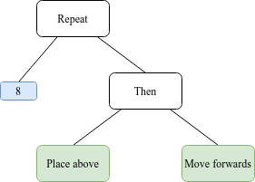
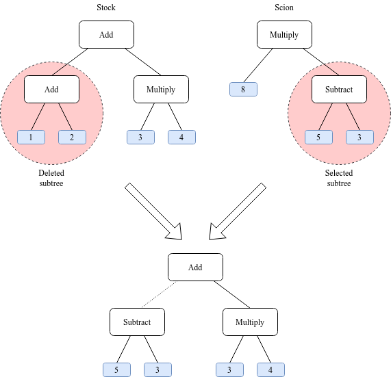
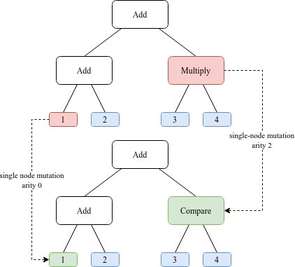
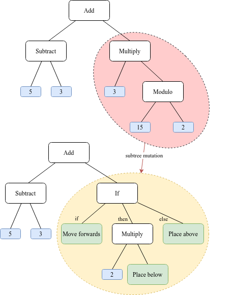

# Genetic programming for building voxel structures with turtle robots

This program is an attempt to use genetic programming to create programs that, when run by a 
[turtle](https://en.wikipedia.org/wiki/Turtle_(robot)), would create a given target structure out of voxels.
It served as the implementation side of my bachelor's thesis. As it turned out, my attempts never produced very
successful results, but I thought the program itself may be worth publishing.

## Working constraints
The robots are specifically inspired by the [turtles from ComputerCraft](https://www.computercraft.info/wiki/Turtle), a
mod for Minecraft. The programs they can run are fairly flexible, with many general-use instructions, as well as
specific instructions for movement and placing and removing voxels or "blocks". They work within a 16x16x16 3D space,
taking up the space of a voxel themselves.

## Program layers

The framework I put together for this project has a few different layers, each one working on top of the previous one.
Most of the layers are written in Rust, though Python is also used on the final layer to modify the Rust code and easily
change the parameters of the runs.

### Simulator
The first layer is a simulator for the test environment. It contains the voxel world and the turtle within. It presents
several functions allowing control of the turtle, detection of the surrounding environment, and access to the current 
state of the block space.

### Linear program virtual machine
The second layer is a virtual machine that can run linear programs made up of instructions. These
instructions are vaguely similar to assembly code, with the notable exception of special instructions interfacing with
a simulator instance, allowing programmatic control of the turtle.

The VM state contains the following:
- a vector of instructions
- a list of labels and an instruction pointer, which allow jumping in the instruction vector
- 256 8-bit integer registers, some of which are used for certain instructions
- a simulator instance

The turtle-specific instructions are:
- move (forwards, backwards, up or down)
- turn (left or right)
- place a block (forwards, up or down)
- remove a block
- check for a block in a direction

### Tree-based programs
Tree-based programs are a better fit for genetic programming, as they are simpler to mutate and crossover while keeping
functionality intact. As such, the third layer involves a structure representing programs as trees made up of nodes,
which are subsequently translated into linear programs and run on the virtual machine.

_This example program loops 8 times through "place above" and then "move forwards", effectively creating a line of 8 
blocks above the turtle from the starting position._

These trees may represent expressions, but many nodes can produce side effects and allow evaluation in a certain order, 
as seen above.

### Genetic algorithm
The fourth layer is a genetic algorithm using tree-based programs as individuals. This effectively simulates an 
evolutionary process, producing random mutations, evaluating individuals' performance and allowing them to "pass on 
their genes" to the next generation. This process repeats for a large number of generations, hopefully "evolving" the
overall population of individuals.

The first generation is created by randomly generating individuals using two methods (for denser and sparser trees) and
several depths. This method is called "ramp half-and-half", as proposed by John R. Koza in 
[Genetic Programming](http://mitpress.mit.edu/books/genetic-programming). This method results in a large variety of 
trees to start with, hopefully providing a relatively unbiased start.

Evaluating the individuals is done using the 
[Sørensen–Dice coefficient](https://en.wikipedia.org/wiki/S%C3%B8rensen%E2%80%93Dice_coefficient), measuring the 
similarity between the target structure and the structure actually built by each individual. This score is then modified
depending on the depth of the tree, to favor simpler solutions that produce the same result as a more complicated one.

Selection is done using one of two methods:
- _tournament selection_, where the winner is chosen as a parent for the next generation. These tournaments
involve picking a number of random individuals, sorting them by their results, and choosing the winner with some 
probability based on how much better it is (so suboptimal individuals have a chance too).
- _fitness proportionate selection_, where the entire population is evaluated at once, and individuals are chosen based
on their performance to be either directly copied into the next generation or to serve as a parent in a _crossover_ 
process

Crossover is best explained using a few terms from horticulture, specifically _grafting_, the technique of cutting off a 
_scion_ from one plant, and grafting it onto another plant called the _stock_. This is also analogous to the real-life
process of chromosomal crossover, where matching regions on two chromosomes break apart and reconnect with each other.
In the code, this effectively involves replacing a subtree from one parent with one from another parent.

_Example of crossover._

Finally, mutation modifies a tree unpredictably, with the goal of hopefully producing useful new changes. This can occur
either through _single mutation_ (replacing one node with another of the same arity) or _subtree mutation_ (cutting 
off a subtree and generating a new, random one).

_Example of single mutation._

_Example of subtree mutation._

### Meta-search
The final layer uses [a Python script](meta_search.py) to modify the Rust code of the main program in order to change
the parameters of the searches. This script runs a large number of searches, trying to find the parameters that will 
produce the best results.

## Results
Keeping things short, the results produced by this program are not great. It yields unsatisfactory results for even
the simplest of test cases, and doesn't even come close to being able to replicate the target structure for more complex
ones. While programming errors cannot be excluded, I think some reasons for the poor results could be related to the 
extremely large search space. The language I designed is *too* flexible, which combined with the large number of
registers it can use leads to there being many, many more useless programs than potentially useful ones. It's also
possible that genetic programming is not actually a good match for this specific use case, as an algorithmic 
3D-printer-like approach could probably yield good results with significantly less effort.

Still, this project was a lot of fun to write and was a good way to learn Rust and more about genetic algorithms, so I 
consider it a success.